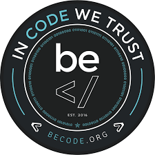

### The hangman

**Création d'un jeu du pendu**

[liste des choes a faire](https://github.com/becodeorg/CRL-Woods-3.21/blob/master/LearningPath/02.The-Hill/11.Javascript/03.JS-Challenges/hangman/readme.md)

1. proposer un mot caché
2. permettre la sélection de lettres
3. vérifier si une lettre sélectionnée appartient au mot
4. compter le nombre d'échecs (vies)
5. vérifier si c'est un jeu terminé
6. vérifier si le mot a été trouvé

## Quand ai-je travaillé dessus : 

J'ai commencé mardi 4 aout 2020 et fini on est mercredi 5 aout 2020 

## Techno utilisé :

1. Html (structure)
2. SASS (style)
3. Javascript 

## Ou j'en suis dans le projet :

Je pense qu'il est fini 

## Qui suis je 

Je m'apelle [Robby Delvaux](https://github.com/Delvaux1986) . apprenant a Becode.org

